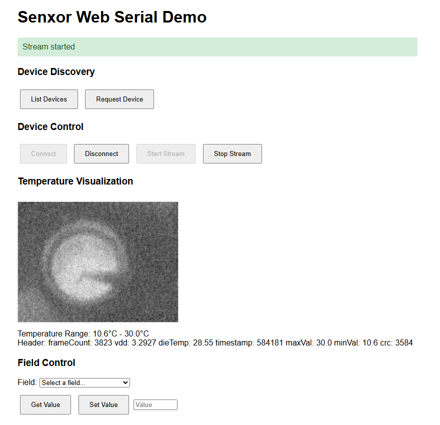

# Senxor Web Serial Example

This is a Vite-based example that shows how to use `@senxor/web-serial` and `@senxor/core` to connect to Senxor devices in a browser using the Web Serial API.

## Prerequisites

- Install dependencies at the repository root:

```bash
pnpm install
```

- Use a browser that supports the Web Serial API (for example, a recent Chromium-based browser).
- Run the app over `https://` or `http://localhost`.

## Run the example

From the repository root:

```bash
cd examples/web-serial
pnpm start
```

This starts the Vite dev server. Check the terminal output for the local URL (typically `http://localhost:5173`) and open it in your browser to interact with the example.

## Screenshot


